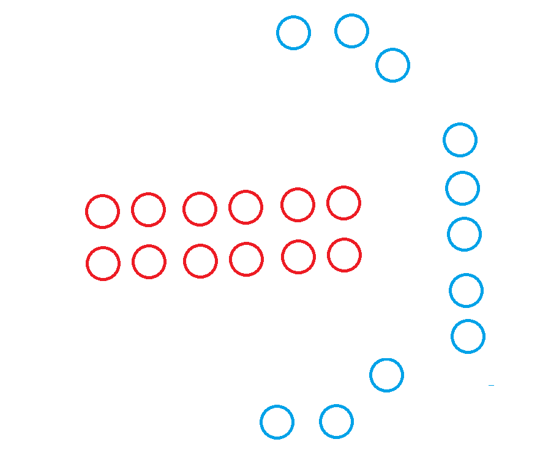
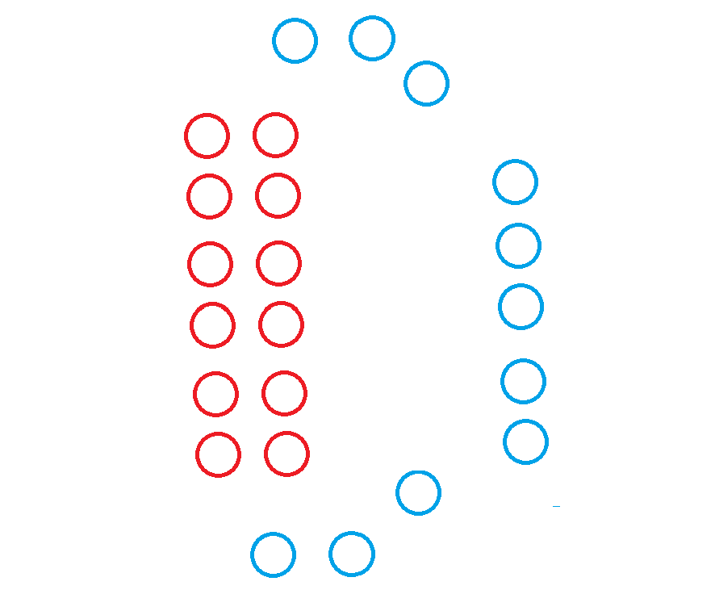
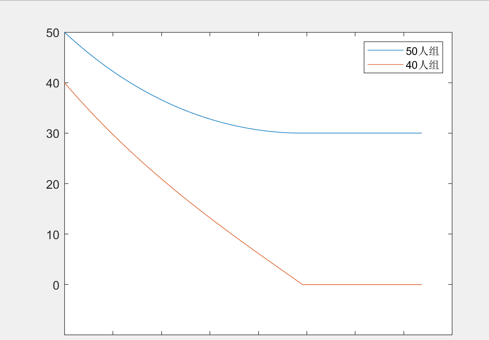

## Welcome to THIS Pages

You can use the [editor on GitHub](https://github.com/fish-yxr/fish-yxr.github.io/edit/main/README.md) to maintain and preview the content for your website in Markdown files.

Whenever you commit to this repository, GitHub Pages will run [Jekyll](https://jekyllrb.com/) to rebuild the pages in your site, from the content in your Markdown files.

## this is a title

And this is a paragraph. This is a paragraph. This is a paragraph. This is a paragraph. This is a paragraph. This is a paragraph. This is a paragraph. This is a paragraph. This is a paragraph. This is a paragraph. This is a paragraph. This is a paragraph. This is a paragraph. This is a paragraph. This is a paragraph. This is a paragraph. This is a paragraph. This is a paragraph. This is a paragraph. This is a paragraph. This is a paragraph. This is a paragraph. This is a paragraph. This is a paragraph. This is a paragraph. This is a paragraph. This is a paragraph. This is a paragraph. This is a paragraph. This is a paragraph. This is a paragraph. This is a paragraph. This is a paragraph. 

with

**web link**

[github](https://github.com)

[youtube](https://youtube.com)

[bilibili](https://bilibili.com)

**failed link**

[link](1234567890)

**picture**







**document**

[pic](square.png)

**code**

```c++
#include <iostream>
using namespace std;
int main(){
    cout<<"hello world"<<endl;
    return 0;
}
```

**math**

$$
f(x)=\frac{g(x+\Delta t)-g(x)}{\Delta t}
$$

### Support or Contact

Having trouble with Pages? Check out our [documentation](https://docs.github.com/categories/github-pages-basics/) or [contact support](https://support.github.com/contact) and we’ll help you sort it out.
